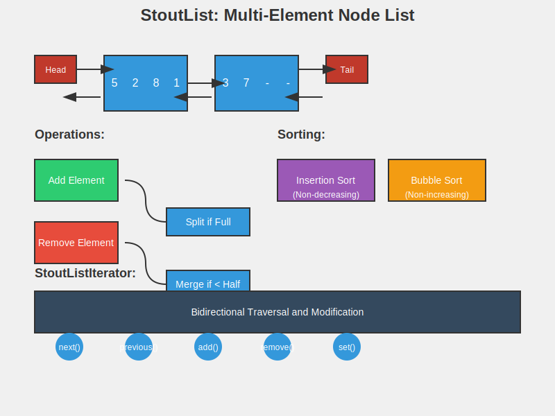

# StoutList: A Specialized Linked List Implementation



## Description

StoutList is a custom implementation of a linked list data structure in Java. It extends AbstractSequentialList and implements a unique approach to storing elements, where each node can contain multiple items. This implementation aims to balance memory usage and performance by ensuring that nodes (except possibly the last one) are at least half full.

## Key Features

1. Multi-element nodes: Each node can store up to M elements (where M is configurable).
2. Efficient space utilization: Nodes are kept at least half full (except possibly the last one).
3. Dynamic node management: Automatic splitting and merging of nodes based on element count.
4. Sorting capabilities: Implements both insertion sort and bubble sort algorithms.
5. Bidirectional iteration: Supports forward and backward traversal with ListIterator.

## Core Components

1. `StoutList<E>`: The main class implementing the custom list structure.
2. `Node`: Inner class representing a node in the list, capable of holding multiple elements.
3. `StoutListIterator`: Inner class implementing ListIterator for traversing the list.

## Key Methods

- `add(E item)`: Adds an item to the end of the list.
- `add(int pos, E item)`: Inserts an item at a specified position.
- `remove(int pos)`: Removes an item at a specified position.
- `sort()`: Sorts the list in non-decreasing order using insertion sort.
- `sortReverse()`: Sorts the list in non-increasing order using bubble sort.
- `iterator()` and `listIterator()`: Return iterators for list traversal.

## Usage Example

```java
StoutList<Integer> list = new StoutList<>(4); // Create a list with node size 4
list.add(5);
list.add(2);
list.add(8);
list.add(1);

System.out.println(list); // Output: [5, 2, 8, 1]

list.sort();
System.out.println(list); // Output: [1, 2, 5, 8]

ListIterator<Integer> iter = list.listIterator();
while (iter.hasNext()) {
    System.out.println(iter.next());
}
```

## Implementation Details

1. **Node Structure**: Each node contains an array of elements and pointers to the next and previous nodes.
2. **Dynamic Node Management**:
   - When adding elements, if a node becomes full, it splits into two nodes.
   - When removing elements, if a node becomes less than half full, it merges with a neighboring node.
3. **Sorting**:
   - Insertion sort is used for ascending order.
   - Bubble sort is used for descending order.
4. **Iteration**: The `StoutListIterator` provides methods for bidirectional traversal and modification of the list during iteration.

## Performance Considerations

- Insertion and deletion at arbitrary positions: O(n) in the worst case, but can be O(1) for operations near already accessed positions.
- Space efficiency: Better than standard linked lists due to multiple elements per node.
- Sorting: O(n^2) for both insertion and bubble sort.

## Future Improvements

1. Implement more efficient sorting algorithms (e.g., merge sort, quicksort).
2. Add support for concurrent modifications with proper synchronization.
3. Optimize the node split and merge operations for better performance.
4. Implement serialization for persistent storage.

## Author

Abhay Prasanna Rao
